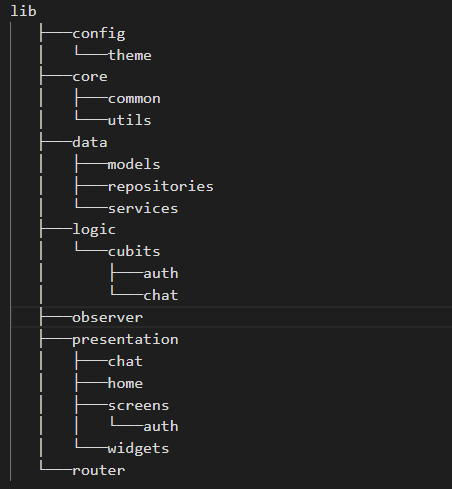

# Messenger (Chat App)

A real-time, cross-platform chat application built with **Flutter** and **Firebase**. This project provides a seamless messaging experience with a modern UI and real-time backend updates.

## Features

- **Real-Time Messaging**  
  Send & receive messages instantly  
- **Online & Typing Indicators**  
  Show user status in real-time  
- **Last Seen & Read/Delivered Receipts**  
  Keep track of user activity  
- **Block/Unblock Users**  
  Full control over who can chat  
- **Unread Count**  
  See how many unread messages you have  
- **Emojis & More**  
  Add fun reactions to your chats
- **Firebase Integration:** Secure backend configuration using Firebase Authentication and Firestore.
- **Responsive UI:** A clean, modern interface optimized for mobile screens.
- **User Authentication:** Secure login and registration flows.
- **Cross-Platform:** Support for Android, iOS.

## 🛠️ Technologies & Tools

* **Frontend:** [Flutter](https://flutter.dev/) (Dart)
* **Backend:** [Firebase](https://firebase.google.com/) (Firestore, Auth)
* **State Management:** *BLoC, Cubeit*
* **Dependency Injection:** GetIt

## 📂 lib folder Structure

<!-- lib
   ├───config
   │   └───theme
   ├───core
   │   ├───common
   │   └───utils
   ├───data
   │   ├───models
   │   ├───repositories
   │   └───services
   ├───logic
   │   └───cubits
   │       ├───auth
   │       └───chat
   ├───observer
   ├───presentation
   │   ├───chat
   │   ├───home
   │   ├───screens
   │   │   └───auth
   │   └───widgets
   └───router -->

## UI Screenshots
